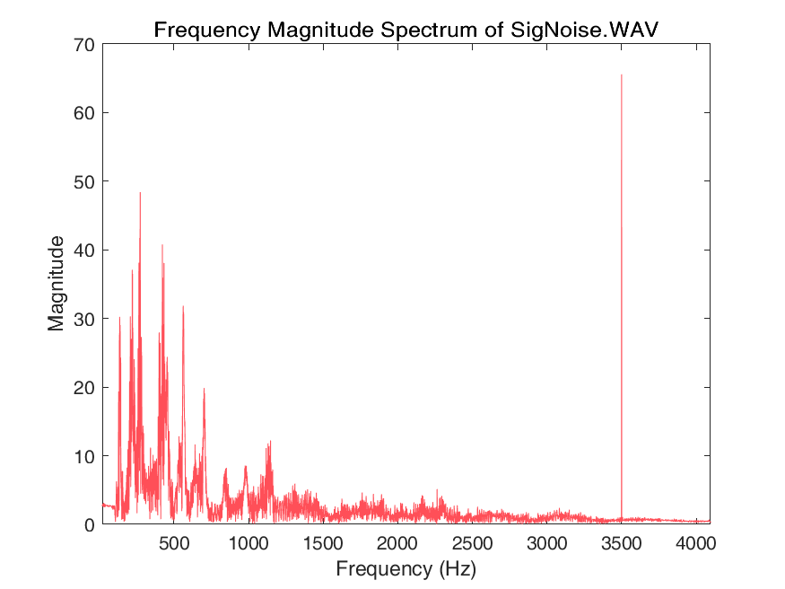
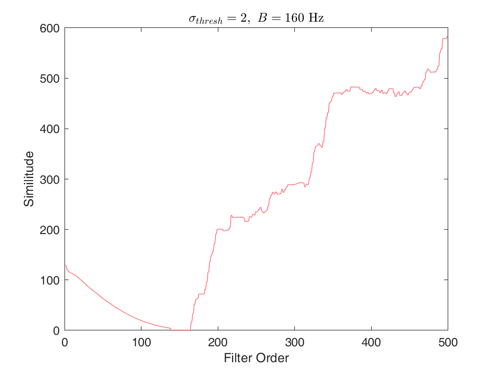
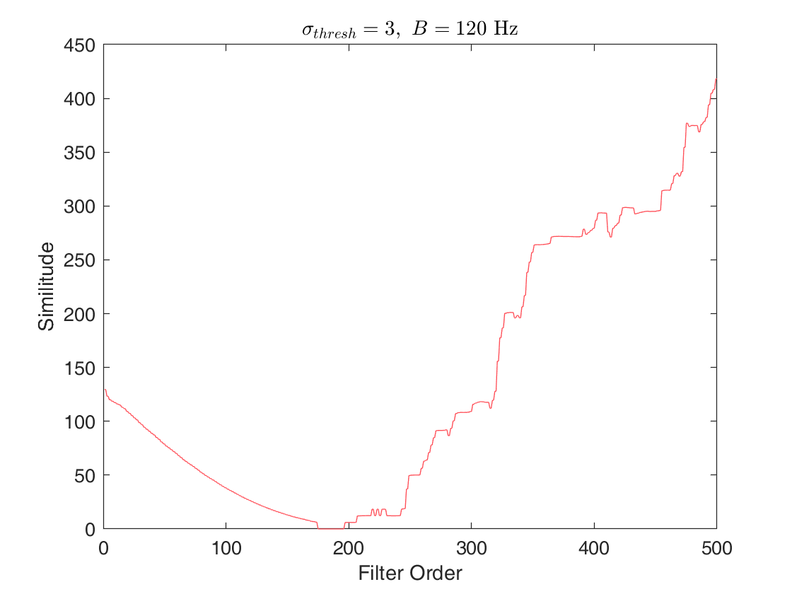

# FIRMan
This repository contains some experimental data I found interesting for my 44DSP Mini-Project. Submitted on February 1, 2021.

## Abstract
The role of a FIR is to capture and remove noise signals. The purpose of this study is to identify the optimum FIR filter specifications which prioritises speed and the prevention of distortion. A pair of vocal signals were given, with one of the signals contaminated with a single frequency signal. Different specifications of FIR were tested for real-time capability with minimal distortion. Low-pass filter type is found to be the fastest (176 ms) and with equally minimal distortion as the band-stop filter type (183 ms). However, every filter type produced latecy lower than 250 ms and is considered an acceptable latency for good quality communication by [Krasniqi et. al.](https://www.semanticscholar.org/paper/VoLTE-Performance-Analysis-and-Evaluation-in-Real-Krasniqi/38d626a6264e816cb28954135109a4c3cfb4ad2f)

  

    
     
  

## Results
Removing the single-frequency noise was simple but while I was looking for the optimum filter order for the different filters, I observed a chaotic relationship between similitude and filter order. I calculated similitude by computing the Manhattan distance between the original and filtered signal, where a smaller Manhattan distance would imply that the filtered signal more closely resembles the original.

  

    
     
  

## Potential Improvements
Looking back, instead of finding the lowest Manhattan distance, computing the mean distance may have weakened the weight of any compounded errors and represented the similitude results better.
